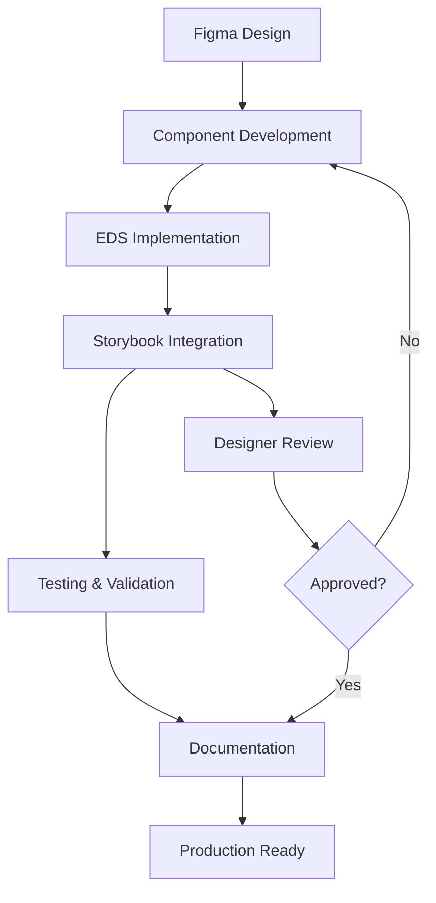

# EDS Atomic Design System - Product Requirements Document

## 1. Product Overview

Implementazione di un design system bassu su **Atomic Design** per Adobe Edge Delivery Services (EDS), partendo dalla creazione degli atomi fondamentali (Button) e scalando verso molecole più complesse. Il sistema permetterà di mantenere coerenza visiva e funzionale tra tutti i componenti del progetto, con visualizzazione e testing tramite Storybook.

- **Obiettivo principale**: Creare una libreria di componenti riutilizzabili seguendo i principi di Atomic Design per garantire scalabilità e manutenibilità del codice.
- **Target**: Team di sviluppo e design che lavorano su progetti EDS, con necessità di componenti standardizzati e documentati.

## 2. Core Features

### 2.1 User Roles

| Role | Registration Method | Core Permissions |
|------|---------------------|------------------|
| Developer | Accesso diretto al repository | Può sviluppare, modificare e testare componenti |
| Designer | Accesso a Storybook | Può visualizzare componenti, testare varianti e fornire feedback |
| Product Manager | Accesso a Storybook e documentazione | Può verificare implementazioni e approvare componenti |

### 2.2 Feature Module

Il sistema di design atomico per EDS consiste nelle seguenti pagine principali:

1. **Storybook Interface**: visualizzazione interattiva dei componenti, controlli per varianti e stati, documentazione integrata.
2. **Component Library**: struttura organizzata di atomi e molecole, codice sorgente EDS-compatibile, file CSS e JavaScript separati.
3. **Documentation Hub**: guide di implementazione, best practices, esempi di utilizzo.

### 2.3 Page Details

| Page Name | Module Name | Feature description |
|-----------|-------------|---------------------|
| Storybook Interface | Component Viewer | Display interactive components with all variants (Primary, Accent, Secondary) and states (Pressed, Hover, Focused, Disabled, Enabled) |
| Storybook Interface | Controls Panel | Allow real-time modification of component properties and states for testing |
| Storybook Interface | Code Preview | Show generated HTML/CSS code for easy copy-paste implementation |
| Component Library | Atoms Structure | Organize button components in atoms/buttons/ with subdirectories for each type |
| Component Library | Button Types | Implement three button types: standard Button, Link Button, and Icon Button |
| Component Library | Variant System | Create Primary, Accent, and Secondary variants for each button type |
| Component Library | State Management | Handle Pressed, Hover, Focused, Disabled, and Enabled states with CSS |
| Documentation Hub | Implementation Guide | Provide step-by-step instructions for using components in EDS projects |
| Documentation Hub | Design Tokens | Document color schemes, typography, spacing, and other design variables |

## 3. Core Process

**Developer Flow:**
1. Il developer accede alla struttura `blocks/atoms/buttons/` per implementare nuovi componenti
2. Crea i file JavaScript e CSS seguendo le convenzioni EDS
3. Testa il componente in Storybook per verificare tutte le varianti e stati
4. Documenta il componente con esempi di utilizzo

**Designer Flow:**
1. Il designer accede a Storybook per visualizzare i componenti implementati
2. Testa le diverse varianti (Primary, Accent, Secondary) e stati interattivi
3. Fornisce feedback sui componenti tramite Storybook
4. Verifica la coerenza con il design Figma originale

## 4. User Interface Design

### 4.1 Design Style

- **Primary Colors**: 
  - Primary: #1976D2 (Blue)
  - Accent: #FF5722 (Orange-Red)  
  - Secondary: #757575 (Gray)
- **Button Style**: Rounded corners (border-radius: 8px), subtle shadows for depth
- **Font**: Roboto family, 14px base size for buttons, 16px for larger variants
- **Layout Style**: Card-based component organization in Storybook, clean grid layout
- **Icons**: Material Design icons for Icon Buttons, consistent 24px size

### 4.2 Page Design Overview

| Page Name | Module Name | UI Elements |
|-----------|-------------|-------------|
| Storybook Interface | Component Grid | Clean grid layout with component previews, hover effects, organized by atomic structure |
| Storybook Interface | Control Panel | Right sidebar with interactive controls, real-time preview updates, toggle switches for states |
| Component Library | Button Variants | Visual hierarchy showing Primary (solid), Accent (solid bright), Secondary (outlined) styles |
| Component Library | State Indicators | Visual feedback for Hover (slight elevation), Pressed (inset shadow), Focused (outline ring), Disabled (opacity 0.6) |
| Documentation Hub | Code Blocks | Syntax-highlighted code examples, copy-to-clipboard functionality, dark theme support |

### 4.3 Responsiveness

Il sistema è progettato mobile-first con adattamento desktop. I componenti button sono ottimizzati per touch interaction con area minima di 44px, e Storybook è completamente responsivo per testing su diversi dispositivi.