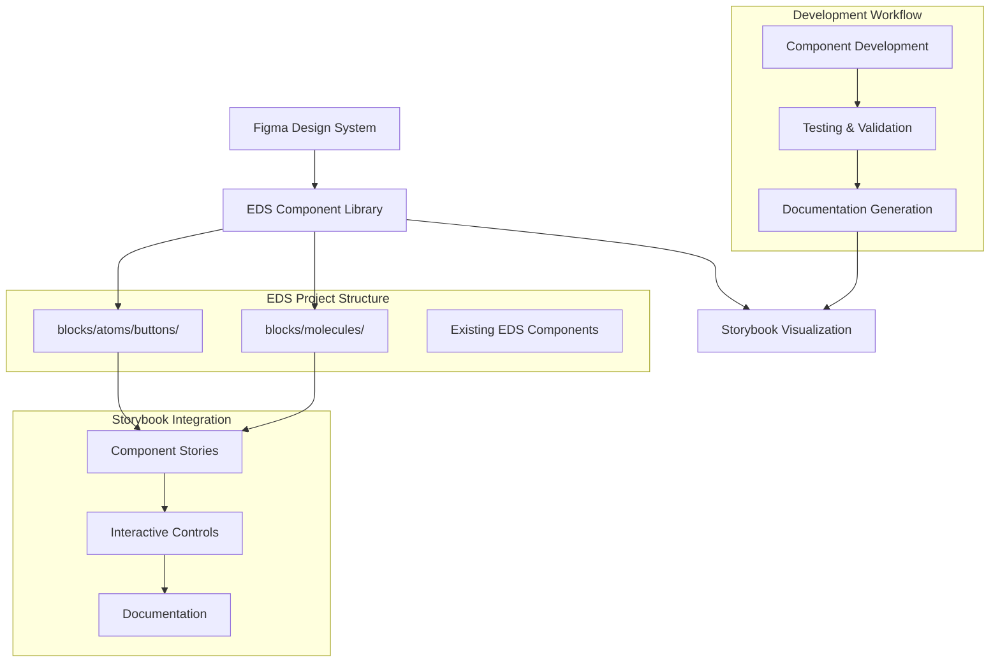
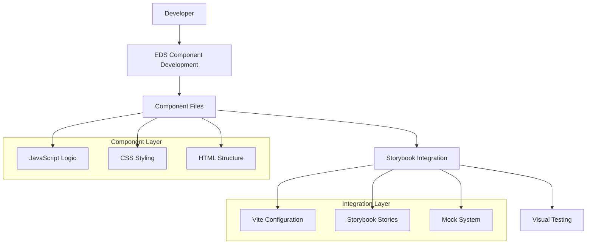
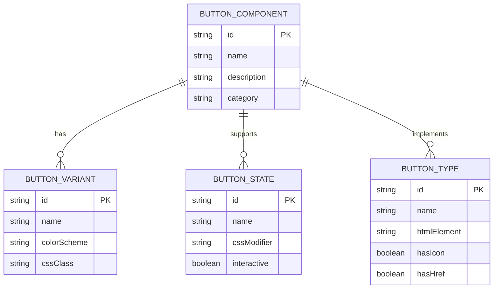

# EDS Atomic Design System - Technical Architecture Document

## 1. Architecture Design



## 2. Technology Description

* Frontend: Vanilla JavaScript + CSS (EDS Compatible)

* Documentation: Storybook\@7 + Vite

* Integration: Direct import from EDS blocks via Vite aliases

* Testing: Storybook interactive testing + Visual regression

## 3. Route definitions

| Route                                              | Purpose                                              |
| -------------------------------------------------- | ---------------------------------------------------- |
| /storybook                                         | Main Storybook interface for component visualization |
| /storybook/?path=/story/atoms-buttons--primary     | Primary button component story                       |
| /storybook/?path=/story/atoms-buttons--accent      | Accent button component story                        |
| /storybook/?path=/story/atoms-buttons--secondary   | Secondary button component story                     |
| /storybook/?path=/story/atoms-buttons--link-button | Link button component story                          |
| /storybook/?path=/story/atoms-buttons--icon-button | Icon button component story                          |

## 4. API definitions

### 4.1 Core API

Component initialization and state management

```javascript
// Button Component API
export default function decorate(block) {
  // Component initialization logic
}

// Button State Management
export function setButtonState(element, state) {
  // State: 'pressed', 'hover', 'focused', 'disabled', 'enabled'
}

// Button Variant Management  
export function setButtonVariant(element, variant) {
  // Variant: 'primary', 'accent', 'secondary'
}
```

Component Configuration:

| Param Name | Param Type | isRequired | Description                                                        |
| ---------- | ---------- | ---------- | ------------------------------------------------------------------ |
| variant    | string     | false      | Button variant: 'primary', 'accent', 'secondary'                   |
| state      | string     | false      | Button state: 'pressed', 'hover', 'focused', 'disabled', 'enabled' |
| type       | string     | false      | Button type: 'button', 'link-button', 'icon-button'                |
| text       | string     | true       | Button text content                                                |
| icon       | string     | false      | Icon name for icon buttons                                         |
| href       | string     | false      | URL for link buttons                                               |

## 5. Server architecture diagram



## 6. Data model

### 6.1 Data model definition



### 6.2 Data Definition Language

Component Structure Definition:

```javascript
// Button Component Structure
const BUTTON_TYPES = {
  STANDARD: 'button',
  LINK: 'link-button', 
  ICON: 'icon-button'
};

const BUTTON_VARIANTS = {
  PRIMARY: 'primary',
  ACCENT: 'accent',
  SECONDARY: 'secondary'
};

const BUTTON_STATES = {
  ENABLED: 'enabled',
  HOVER: 'hover',
  FOCUSED: 'focused', 
  PRESSED: 'pressed',
  DISABLED: 'disabled'
};

// File Structure Definition
const COMPONENT_STRUCTURE = {
  'blocks/atoms/buttons/button/': {
    files: ['button.js', 'button.css', '_button.json'],
    variants: ['primary', 'accent', 'secondary'],
    states: ['enabled', 'hover', 'focused', 'pressed', 'disabled']
  },
  'blocks/atoms/buttons/link-button/': {
    files: ['link-button.js', 'link-button.css', '_link-button.json'],
    variants: ['primary', 'accent', 'secondary'],
    states: ['enabled', 'hover', 'focused', 'pressed', 'disabled']
  },
  'blocks/atoms/buttons/icon-button/': {
    files: ['icon-button.js', 'icon-button.css', '_icon-button.json'],
    variants: ['primary', 'accent', 'secondary'],
    states: ['enabled', 'hover', 'focused', 'pressed', 'disabled']
  }
};
```

CSS Custom Properties Definition:

```css
/* Design Tokens for Button System */
:root {
  /* Primary Variant */
  --button-primary-bg: #1976D2;
  --button-primary-color: #FFFFFF;
  --button-primary-border: #1976D2;
  
  /* Accent Variant */
  --button-accent-bg: #FF5722;
  --button-accent-color: #FFFFFF;
  --button-accent-border: #FF5722;
  
  /* Secondary Variant */
  --button-secondary-bg: transparent;
  --button-secondary-color: #757575;
  --button-secondary-border: #757575;
  
  /* State Modifiers */
  --button-hover-opacity: 0.9;
  --button-pressed-scale: 0.98;
  --button-disabled-opacity: 0.6;
  --button-focus-outline: 2px solid #1976D2;
  
  /* Sizing */
  --button-padding: 12px 24px;
  --button-border-radius: 8px;
  --button-font-size: 14px;
  --button-min-height: 44px;
}
```

