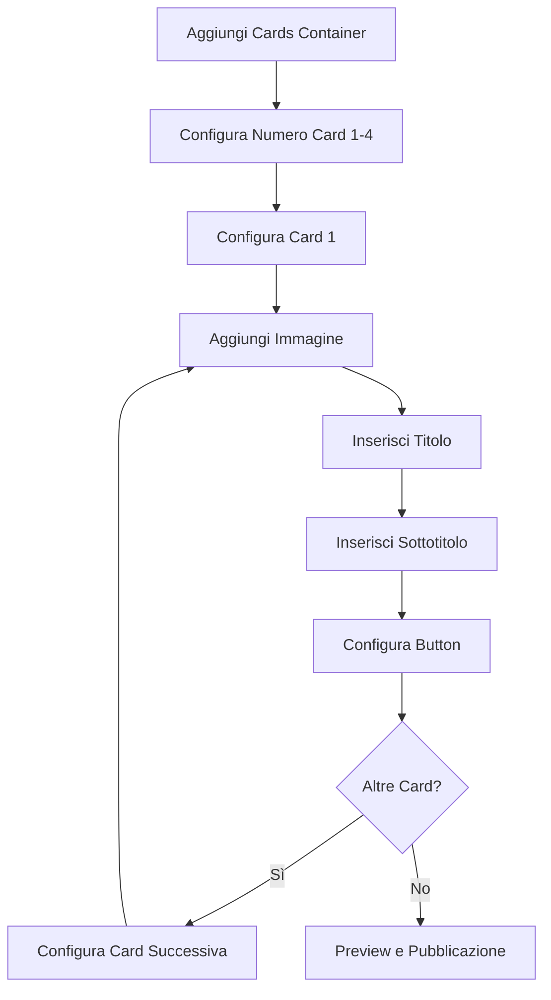
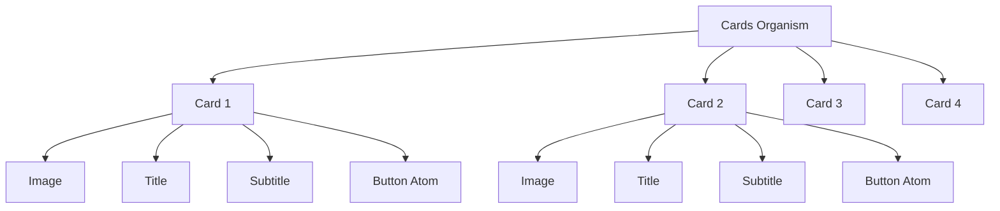

# Sistema Componenti Cards EDS - Documento dei Requisiti di Prodotto

## 1. Panoramica del Prodotto

Implementazione di un sistema gerarchico di componenti per EDS (Edge Delivery Services) che segue i principi dell'Atomic Design, con focus sul componente Cards come organismo contenitore per multiple istanze del componente Card.

- **Obiettivo**: Creare una struttura componenti ben organizzata e riutilizzabile che rispetti la gerarchia Organismo → Molecola → Atomo
- **Valore**: Migliorare la manutenibilità, riusabilità e coerenza del design system EDS

## 2. Funzionalità Principali

### 2.1 Ruoli Utente

| Ruolo | Metodo di Accesso | Permessi Principali |
|-------|-------------------|---------------------|
| Content Author | AEM Universal Editor | Può creare e modificare contenuti Cards, configurare singole Card |
| Developer | Codice EDS | Può modificare logica componenti, stili CSS, configurazioni JSON |

### 2.2 Modulo Funzionalità

Il sistema di componenti Cards è strutturato su tre livelli gerarchici:

1. **Cards (Organismo)**: Container principale che gestisce da 1 a 4 istanze di Card
2. **Card (Molecola)**: Singola card con immagine, titolo, sottotitolo e button
3. **Button (Atomo)**: Componente button riutilizzabile già esistente

### 2.3 Dettagli delle Pagine

| Nome Pagina | Nome Modulo | Descrizione Funzionalità |
|-------------|-------------|--------------------------|
| AEM Universal Editor | Cards Container | Permette di aggiungere il componente Cards e configurare il numero di card (1-4). Gestisce layout e spaziatura del container |
| AEM Universal Editor | Card Configuration | Configura ogni singola card: carica immagine, inserisce titolo, sottotitolo, configura button con testo e link |
| AEM Universal Editor | Button Settings | Utilizza il componente button atomico esistente con configurazioni: testo, variante (primary/secondary), dimensione, stato disabled |

## 3. Processo Principale

### Flusso Authoring Content:
1. **Aggiunta Cards**: L'autore aggiunge il componente Cards alla pagina
2. **Configurazione Container**: Imposta il numero di card desiderate (1-4) e layout
3. **Configurazione Card**: Per ogni card configura immagine, titolo, sottotitolo
4. **Configurazione Button**: Per ogni card configura il button utilizzando il componente atomico
5. **Preview e Pubblicazione**: Verifica il risultato e pubblica



## 4. Design dell'Interfaccia Utente

### 4.1 Stile di Design

- **Colori Primari**: Utilizzo dei design tokens esistenti di Unipol
- **Colori Secondari**: Grigi per testi secondari e bordi
- **Stile Button**: Riutilizzo del componente button atomico esistente (primary, secondary, accent)
- **Font**: Roboto family già configurata nel sistema
- **Layout**: Grid responsive con gap consistente tra le card
- **Icone**: Utilizzo degli icon esistenti nel sistema EDS

### 4.2 Panoramica Design delle Pagine

| Nome Pagina | Nome Modulo | Elementi UI |
|-------------|-------------|-------------|
| Cards Container | Layout Grid | Grid responsive 1-4 colonne, gap 24px, padding container 16px, bordi arrotondati 8px |
| Single Card | Card Structure | Container card con shadow sottile, padding 20px, border-radius 12px, hover effect con transform scale(1.02) |
| Card Image | Image Display | Aspect ratio 16:9, object-fit cover, border-radius 8px top, lazy loading |
| Card Content | Text Content | Titolo h3 font-size 1.25rem font-weight 600, sottotitolo p font-size 0.875rem color gray-600, margin-bottom 16px |
| Card Button | Button Component | Utilizzo button atomico, full-width su mobile, fixed-width su desktop, margin-top auto per allineamento bottom |

### 4.3 Responsività

- **Desktop-first** con adattamento mobile
- **Breakpoints**: 
  - Desktop (>1024px): Grid 4 colonne
  - Tablet (768-1024px): Grid 2 colonne  
  - Mobile (<768px): Grid 1 colonna
- **Touch optimization**: Button con min-height 44px, hover states solo su desktop

## 5. Architettura Tecnica

### 5.1 Struttura File

```
blocks/
├── atoms/
│   └── buttons/
│       └── button/
│           ├── _button.json (già esistente)
│           ├── button.js
│           └── button.css
├── molecules/
│   └── card/
│       ├── _card.json (da creare)
│       ├── card.js (già esistente)
│       └── card.css (già esistente)
└── organisms/
    └── cards/
        ├── _cards.json (da aggiornare)
        ├── cards.js (da creare)
        └── cards.css (da creare)
```

### 5.2 Configurazione JSON

**_cards.json** (Organismo):
- Definisce il container Cards
- Configura il filtro per accettare componenti Card
- Limita il numero massimo a 4 card
- Gestisce layout e spaziatura

**_card.json** (Molecola):
- Definisce la struttura della singola Card
- Campi: image, title, subtitle, button
- Integrazione con il componente button atomico
- Validazioni per campi obbligatori

### 5.3 Composizione Componenti



### 5.4 Data Flow

1. **Cards Container** riceve configurazione numero card e layout
2. **Ogni Card** riceve i propri dati (image, title, subtitle, button config)
3. **Button Atom** riceve configurazione da Card parent (text, variant, href)
4. **Rendering** avviene in cascata: Cards → Card → Button

## 6. Implementazione

### 6.1 Priorità di Sviluppo

1. **Fase 1**: Aggiornamento _cards.json con nuova struttura
2. **Fase 2**: Creazione _card.json per molecola Card
3. **Fase 3**: Implementazione cards.js e cards.css
4. **Fase 4**: Aggiornamento card.js per integrazione button
5. **Fase 5**: Testing e validazione authoring experience

### 6.2 Criteri di Accettazione

- ✅ Cards container accetta 1-4 card
- ✅ Ogni card ha tutti i campi richiesti (image, title, subtitle, button)
- ✅ Button utilizza il componente atomico esistente
- ✅ Layout responsive funziona correttamente
- ✅ Authoring experience è intuitiva in AEM Universal Editor
- ✅ Performance ottimali (lazy loading immagini)
- ✅ Accessibilità conforme WCAG 2.1 AA

## 7. Considerazioni Tecniche

### 7.1 Limitazioni

- Massimo 4 card per container (limite UX e performance)
- Immagini devono rispettare aspect ratio 16:9
- Button text limitato a 50 caratteri per layout consistency

### 7.2 Estensibilità

- Sistema preparato per aggiungere nuovi tipi di card (video card, product card)
- Possibilità di aggiungere varianti layout (carousel, masonry)
- Integrazione futura con altri organismi (hero + cards, testimonials + cards)