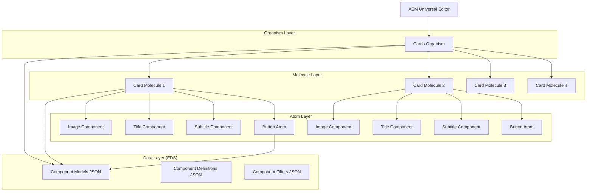
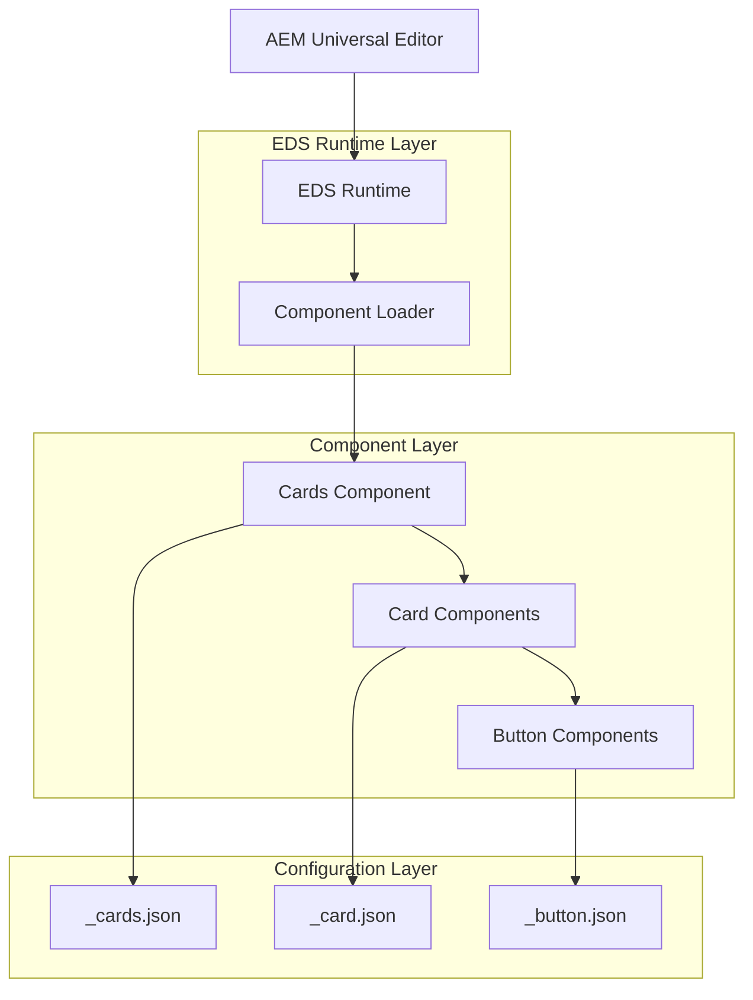
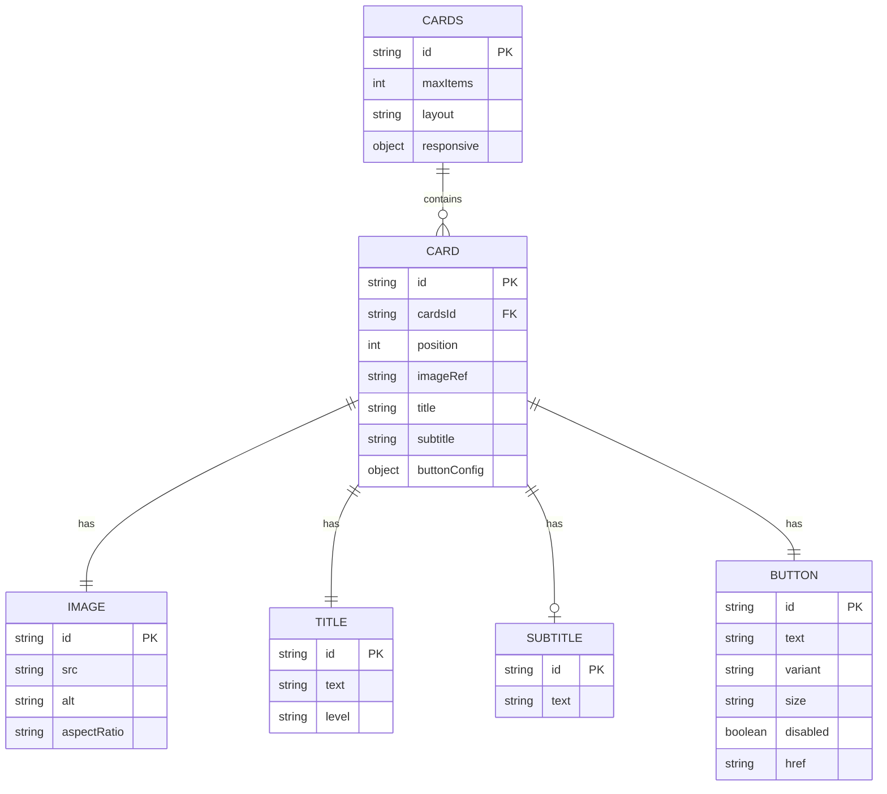

# Architettura Tecnica - Sistema Componenti Cards EDS

## 1. Design dell'Architettura



## 2. Descrizione Tecnologie

- **Frontend**: EDS (Edge Delivery Services) + Vanilla JavaScript + CSS3
- **Authoring**: AEM Universal Editor
- **Build System**: npm scripts per generazione JSON da _*.json files
- **Styling**: CSS3 con CSS Custom Properties per design tokens

## 3. Definizioni Route

| Route | Scopo |
|-------|-------|
| /blocks/organisms/cards/cards.js | Logica principale del container Cards |
| /blocks/organisms/cards/cards.css | Stili del container e layout grid |
| /blocks/molecules/card/card.js | Logica della singola Card e integrazione Button |
| /blocks/molecules/card/card.css | Stili della Card molecule |
| /blocks/atoms/buttons/button/button.js | Logica del Button atom (esistente) |
| /blocks/atoms/buttons/button/button.css | Stili del Button atom (esistente) |

## 4. Definizioni API

### 4.1 API Configurazione Componenti

**Cards Container Configuration**
```json
{
  "id": "cards",
  "maxItems": 4,
  "layout": "grid",
  "responsive": {
    "desktop": 4,
    "tablet": 2,
    "mobile": 1
  }
}
```

**Card Configuration**
```json
{
  "id": "card",
  "fields": {
    "image": {
      "type": "reference",
      "required": true,
      "aspectRatio": "16:9"
    },
    "title": {
      "type": "text",
      "required": true,
      "maxLength": 100
    },
    "subtitle": {
      "type": "text",
      "required": false,
      "maxLength": 200
    },
    "button": {
      "type": "component",
      "component": "button",
      "required": true
    }
  }
}
```

**Button Configuration (Existing)**
```json
{
  "id": "button",
  "fields": {
    "text": {
      "type": "text",
      "required": true,
      "maxLength": 50
    },
    "variant": {
      "type": "select",
      "options": ["primary", "secondary", "accent"],
      "default": "primary"
    },
    "size": {
      "type": "select", 
      "options": ["small", "medium", "large"],
      "default": "medium"
    },
    "disabled": {
      "type": "boolean",
      "default": false
    }
  }
}
```

## 5. Architettura Server



## 6. Modello Dati

### 6.1 Definizione Modello Dati



### 6.2 Data Definition Language

**Cards Container Structure**
```javascript
// cards.js - Organism
export default function decorate(block) {
  const cards = [...block.children];
  
  // Limit to maximum 4 cards
  if (cards.length > 4) {
    cards.splice(4);
  }
  
  // Create grid container
  const container = document.createElement('div');
  container.className = 'cards-container';
  
  // Process each card
  cards.forEach((card, index) => {
    const cardElement = createCard(card, index);
    container.appendChild(cardElement);
  });
  
  block.replaceWith(container);
}

function createCard(cardData, index) {
  const cardElement = document.createElement('div');
  cardElement.className = 'card-item';
  cardElement.dataset.index = index;
  
  // Delegate to card molecule
  return cardElement;
}
```

**Card Molecule Structure**
```javascript
// card.js - Molecule  
export default function decorate(block) {
  const [imageRow, titleRow, subtitleRow, buttonRow] = block.children;
  
  // Create card structure
  const card = document.createElement('article');
  card.className = 'card';
  
  // Image (top)
  if (imageRow) {
    const image = createImageElement(imageRow);
    card.appendChild(image);
  }
  
  // Content container
  const content = document.createElement('div');
  content.className = 'card-content';
  
  // Title
  if (titleRow) {
    const title = createTitleElement(titleRow);
    content.appendChild(title);
  }
  
  // Subtitle
  if (subtitleRow) {
    const subtitle = createSubtitleElement(subtitleRow);
    content.appendChild(subtitle);
  }
  
  // Button (using atom)
  if (buttonRow) {
    const button = createButtonElement(buttonRow);
    content.appendChild(button);
  }
  
  card.appendChild(content);
  block.replaceWith(card);
}
```

**CSS Structure**
```css
/* cards.css - Organism */
.cards-container {
  display: grid;
  gap: 24px;
  padding: 16px;
  grid-template-columns: repeat(auto-fit, minmax(280px, 1fr));
  max-width: 1200px;
  margin: 0 auto;
}

@media (min-width: 768px) {
  .cards-container {
    grid-template-columns: repeat(2, 1fr);
  }
}

@media (min-width: 1024px) {
  .cards-container {
    grid-template-columns: repeat(4, 1fr);
  }
}

/* card.css - Molecule */
.card {
  background: white;
  border-radius: 12px;
  box-shadow: 0 2px 8px rgba(0, 0, 0, 0.1);
  overflow: hidden;
  transition: transform 0.2s ease;
  display: flex;
  flex-direction: column;
  height: 100%;
}

.card:hover {
  transform: translateY(-4px);
  box-shadow: 0 4px 16px rgba(0, 0, 0, 0.15);
}

.card-image {
  width: 100%;
  aspect-ratio: 16/9;
  object-fit: cover;
}

.card-content {
  padding: 20px;
  display: flex;
  flex-direction: column;
  flex-grow: 1;
}

.card-title {
  font-size: 1.25rem;
  font-weight: 600;
  margin: 0 0 8px 0;
  color: var(--text-primary);
}

.card-subtitle {
  font-size: 0.875rem;
  color: var(--text-secondary);
  margin: 0 0 16px 0;
  flex-grow: 1;
}

.card-button {
  margin-top: auto;
}
```

**JSON Configuration Files**

**_cards.json**
```json
{
  "definitions": [
    {
      "title": "Cards Container",
      "id": "cards",
      "plugins": {
        "xwalk": {
          "page": {
            "resourceType": "core/franklin/components/block/v1/block",
            "template": {
              "name": "Cards",
              "filter": "cards"
            }
          }
        }
      }
    }
  ],
  "models": [
    {
      "id": "cards",
      "fields": [
        {
          "component": "number",
          "name": "maxCards",
          "label": "Maximum Cards",
          "value": 4,
          "description": "Maximum number of cards (1-4)"
        }
      ]
    }
  ],
  "filters": [
    {
      "id": "cards",
      "components": ["card"]
    }
  ]
}
```

**_card.json**
```json
{
  "definitions": [
    {
      "title": "Card",
      "id": "card",
      "plugins": {
        "xwalk": {
          "page": {
            "resourceType": "core/franklin/components/block/v1/block/item",
            "template": {
              "name": "Card",
              "model": "card"
            }
          }
        }
      }
    }
  ],
  "models": [
    {
      "id": "card",
      "fields": [
        {
          "component": "reference",
          "name": "image",
          "label": "Card Image",
          "required": true
        },
        {
          "component": "text",
          "name": "title",
          "label": "Card Title",
          "required": true
        },
        {
          "component": "text",
          "name": "subtitle", 
          "label": "Card Subtitle"
        },
        {
          "component": "reference",
          "name": "button",
          "label": "Card Button",
          "required": true
        }
      ]
    }
  ]
}
```

## 7. Integrazione e Deployment

### 7.1 Build Process

1. **Development**: Modifica dei file _*.json nei rispettivi componenti
2. **Build**: Esecuzione `npm run build:json` per generare i file consolidati
3. **Testing**: Verifica in AEM Universal Editor
4. **Deployment**: Push su repository per attivazione EDS

### 7.2 Performance Considerations

- **Lazy Loading**: Immagini caricate solo quando visibili
- **CSS Optimization**: Utilizzo di CSS Grid nativo per performance
- **JavaScript Minimal**: Logica essenziale senza framework pesanti
- **Caching**: Sfruttamento del caching EDS per componenti statici

### 7.3 Accessibility

- **Semantic HTML**: Utilizzo di `<article>` per card, `<h3>` per titoli
- **Alt Text**: Obbligatorio per tutte le immagini
- **Keyboard Navigation**: Button accessibili via tastiera
- **Screen Reader**: Struttura logica per lettori di schermo
- **Color Contrast**: Rispetto WCAG 2.1 AA per tutti i testi